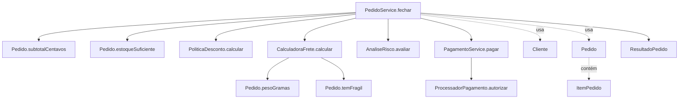
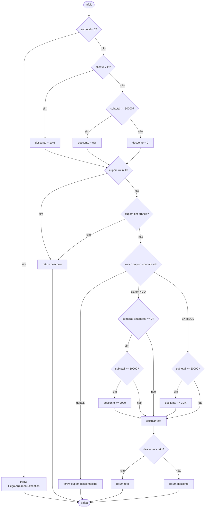
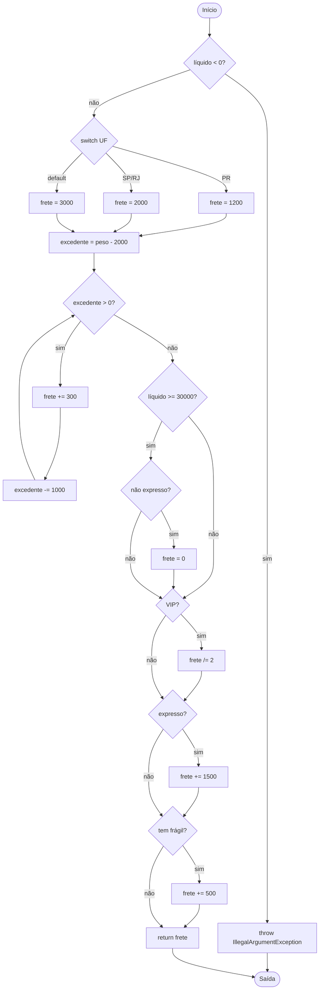
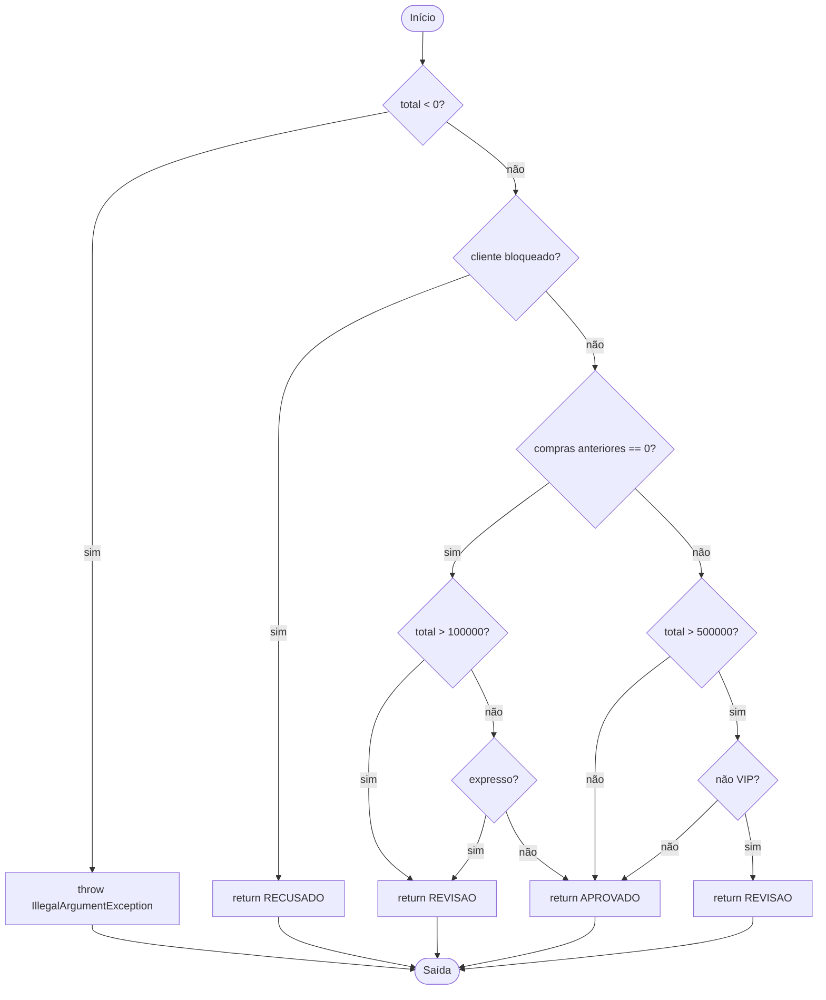
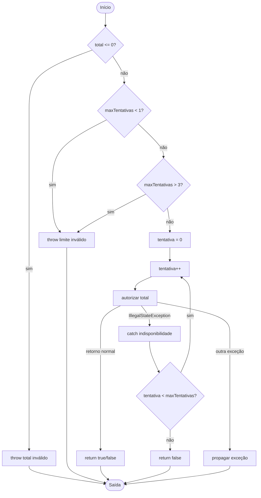
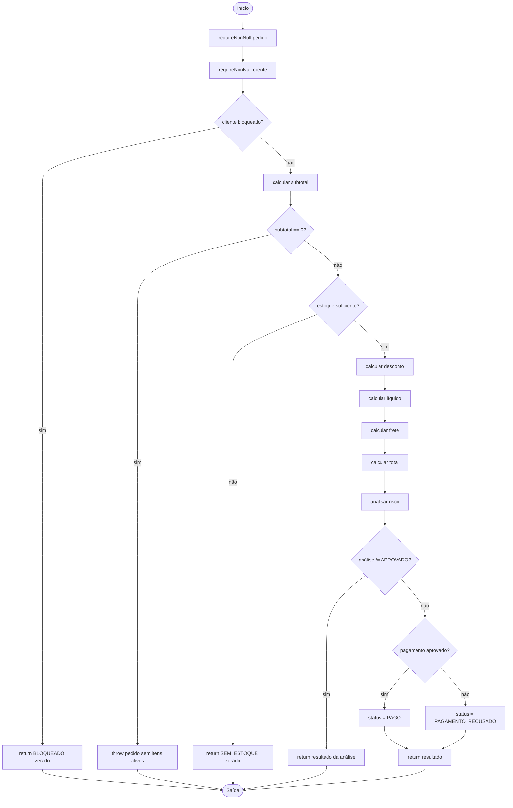

# Relatório de teste estrutural — Central de Pedidos

**Integrantes:** preencher com os nomes do grupo antes da entrega.

## 1. Objetivo e estratégia

O projeto foi testado sem alterar as regras de produção. A suíte usa JUnit 5 e cobre as classes de domínio, as calculadoras, análise de risco, pagamento e a colaboração completa em `PedidoService`.

Foram priorizados:

- valores imediatamente abaixo, iguais e acima dos limites do contrato;
- resultados verdadeiro/falso das decisões;
- condições com curto-circuito `&&` e `||`;
- `switch`, `for`, `continue`, `break`, `while` e `do/while`;
- retornos antecipados;
- exceções explícitas e exceções propagadas;
- quantidade e ordem das chamadas ao processador de pagamento;
- caminhos unitários que não são alcançáveis pelo serviço completo.

A suíte final contém **96 métodos/definições de teste** (`88 @Test` e `8 @ParameterizedTest`) e corresponde a **117 invocações** quando os casos parametrizados são expandidos.

> Observação sobre execução: o ambiente usado para preparar este relatório possui Java 21, mas não possui o executável `mvn`. Por isso, os percentuais do JaCoCo não foram inventados. Os fontes de produção e de teste foram compilados com `javac --release 17`, e as 117 invocações foram executadas por um runner temporário compatível com as anotações utilizadas, resultando em **117 aprovadas e 0 falhas**. No computador de entrega, execute `mvn clean test` para gerar os percentuais oficiais em `target/site/jacoco/index.html`.

---

## 2. Relacionamento entre classes e grafo de chamadas



A ordem principal em `PedidoService.fechar` é:

1. validar referências;
2. verificar bloqueio;
3. calcular subtotal;
4. verificar estoque;
5. calcular desconto;
6. calcular frete;
7. analisar risco;
8. tentar pagamento até três vezes quando houver `IllegalStateException`;
9. retornar `ResultadoPedido`.

---

## 3. Modelo adotado para os CFGs

Para manter os cálculos consistentes, foi usado o seguinte modelo:

- cada expressão booleana atômica de um curto-circuito é tratada como um nó de decisão separado;
- um `switch` contribui com `k - 1` para a complexidade quando possui `k` destinos distintos de fluxo;
- laços (`while` e `do/while`) têm a condição representada como nó de decisão;
- todos os `return` e `throw` são conectados a uma **saída unificada**;
- exceções que apenas podem ser propagadas por chamadas externas não são transformadas em decisões no CFG do chamador;
- em `PagamentoService.pagar`, entretanto, a chamada a `autorizar` tem tratamento explícito de `IllegalStateException`, por isso o fluxo normal, o fluxo para o `catch` e a propagação de outra exceção são representados;
- para cada grafo conectado foi calculado `V(G) = E - N + 2`.

### Resumo da complexidade

| Método | Nós (N) | Arestas (E) | V(G) | Base mínima de caminhos |
| --- | ---: | ---: | ---: | ---: |
| `PoliticaDesconto.calcular` | 23 | 33 | 12 | 12 |
| `CalculadoraFrete.calcular` | 22 | 30 | 10 | 10 |
| `AnaliseRisco.avaliar` | 14 | 20 | 8 | 8 |
| `PagamentoService.pagar` | 15 | 20 | 7 | 7 |
| `PedidoService.fechar` | 22 | 26 | 6 | 6 |

---

## 4. CFG — `PoliticaDesconto.calcular`



**Cálculo:** `V(G) = 33 - 23 + 2 = 12`.

### Base de caminhos proposta

1. subtotal negativo → exceção;
2. VIP + cupom nulo → 10%;
3. comum com subtotal exatamente R$ 500,00 + cupom nulo → 5%;
4. comum abaixo de R$ 500,00 + cupom em branco → 0%;
5. `BEMVINDO` com cliente que já comprou → sem adicional;
6. `BEMVINDO` em primeira compra abaixo de R$ 100,00 → sem adicional;
7. `BEMVINDO` em primeira compra exatamente em R$ 100,00 → +R$ 20,00 sem ultrapassar teto;
8. VIP + `BEMVINDO` → desconto calculado ultrapassa teto e é limitado a 20%;
9. `EXTRA10` abaixo de R$ 200,00 → sem adicional;
10. `EXTRA10` exatamente em R$ 200,00 → +10%;
11. cupom desconhecido → exceção;
12. cupom normalizado com espaços/minúsculas e desconto combinado abaixo do teto.

---

## 5. CFG — `CalculadoraFrete.calcular`



**Cálculo:** `V(G) = 30 - 22 + 2 = 10`.

### Base de caminhos proposta

1. líquido negativo → exceção;
2. PR, até 2 kg, não VIP, normal, sem frágil;
3. SP/RJ, até 2 kg;
4. UF padrão, até 2 kg;
5. peso um grama acima de 2 kg → uma iteração;
6. peso acima de 3 kg → múltiplas iterações;
7. líquido exatamente R$ 300,00 + normal → base/peso zerados;
8. líquido >= R$ 300,00 + expresso → curto-circuito da gratuidade falha na segunda condição;
9. VIP → metade do valor calculado antes dos adicionais;
10. expresso + frágil → aplica ambos os adicionais; teste combinado também verifica ordem.

Além da base, foram testados PR, SP e RJ separadamente e os limites de peso 2000, 2001, 3000 e 3001 g.

---

## 6. CFG — `AnaliseRisco.avaliar`



**Cálculo:** `V(G) = 20 - 14 + 2 = 8`.

### Base de caminhos proposta

1. total negativo → exceção;
2. bloqueado → `RECUSADO`;
3. novo, total <= R$ 1.000,00, normal → `APROVADO`;
4. novo, total > R$ 1.000,00 → `REVISAO` sem avaliar expresso;
5. novo, total <= R$ 1.000,00 e expresso → `REVISAO`;
6. antigo, total <= R$ 5.000,00 → `APROVADO`;
7. antigo, total > R$ 5.000,00 e não VIP → `REVISAO`;
8. antigo, total > R$ 5.000,00 e VIP → `APROVADO`.

O caminho `cliente bloqueado -> RECUSADO` é testável diretamente em `AnaliseRisco`, mas não é alcançável dentro de `PedidoService` porque o serviço retorna `BLOQUEADO` antes de chamar a análise de risco.

---

## 7. CFG — `PagamentoService.pagar`



**Cálculo:** `V(G) = 20 - 15 + 2 = 7`.

### Base de caminhos proposta

1. total <= 0 → exceção;
2. `maxTentativas < 1` → exceção;
3. `maxTentativas > 3` → exceção;
4. autorização retorna normalmente na primeira tentativa;
5. `IllegalStateException` e depois sucesso → repete;
6. `IllegalStateException` até esgotar o limite → `false`;
7. outra exceção → propagada imediatamente.

Foram testados separadamente retorno normal `true` e `false`, porque ambos são efeitos observáveis importantes mesmo compartilhando o mesmo caminho estrutural no método.

---

## 8. CFG — `PedidoService.fechar`



**Cálculo:** `V(G) = 26 - 22 + 2 = 6`.

### Base de caminhos proposta

1. cliente bloqueado → `BLOQUEADO`;
2. cliente não bloqueado + subtotal zero → exceção;
3. subtotal positivo + falta de estoque → `SEM_ESTOQUE`;
4. estoque suficiente + risco pendente → `REVISAO` sem cobrança;
5. risco aprovado + pagamento `true` → `PAGO`;
6. risco aprovado + pagamento `false`/tentativas esgotadas → `PAGAMENTO_RECUSADO`.

Exceções de cupom inválido e exceções definitivas do processador também foram testadas como caminhos excepcionais propagados.

---

## 9. Matriz de testes

A tabela abaixo resume os casos mais relevantes. Os arquivos de teste contêm casos adicionais de validação e limites.

| ID / método JUnit | Unidade | Entrada / estado | Resultado esperado | Caminho / critério |
| --- | --- | --- | --- | --- |
| `ClienteTest.deveRejeitarHistoricoNegativo` | Cliente | compras = -1 | `IllegalArgumentException` | validação inválida |
| `ItemPedidoTest.deveRejeitarSkuNulo` | ItemPedido | SKU `null` | exceção | primeiro operando de `||` |
| `ItemPedidoTest.deveRejeitarSkuEmBranco` | ItemPedido | SKU branco | exceção | segundo operando de `||` |
| `ItemPedidoTest.deveAceitarLimitesSuperioresValidos` | ItemPedido | preço/quantidade/peso máximos | objeto válido | limites iguais |
| `PedidoTest.deveRejeitarMaisDeCemLinhas` | Pedido | 101 linhas | exceção | limite superior |
| `PedidoTest.deveRejeitarElementoNuloNaLista` | Pedido | elemento `null` | `NullPointerException` | `List.copyOf` |
| `PedidoTest.deveCalcularSubtotalIgnorandoLinhaInativa` | Pedido | linha com quantidade 0 | não soma linha | `for` + `continue` |
| `PedidoTest.devePararNaPrimeiraLinhaSemEstoque` | Pedido | primeira linha indisponível | `false` | `break` no início |
| `PedidoTest.deveDetectarFaltaDeEstoqueNaUltimaLinha` | Pedido | última linha indisponível | `false` | várias iterações + `break` |
| `PoliticaDescontoTest.vipDeveReceberDezPorCento` | Desconto | VIP | 10% | ramo VIP |
| `PoliticaDescontoTest.clienteComumDeveReceberCincoPorCentoAoAtingirQuinhentosReais` | Desconto | R$ 500,00 | 5% | limite igual |
| `PoliticaDescontoTest.clienteComumNaoDeveReceberDescontoBaseAbaixoDeQuinhentosReais` | Desconto | R$ 499,99 | 0 | limite abaixo |
| `PoliticaDescontoTest.bemVindoDeveSomarVinteReaisParaPrimeiraCompraElegivel` | Desconto | primeira compra, R$ 100 | +R$20 | `&&` verdadeiro |
| `PoliticaDescontoTest.bemVindoNaoDeveSomarDescontoParaClienteComCompraAnterior` | Desconto | compras > 0 | sem adicional | curto-circuito no 1º operando |
| `PoliticaDescontoTest.bemVindoNaoDeveSomarDescontoAbaixoDeCemReais` | Desconto | primeira compra, R$ 99,99 | sem adicional | 2º operando falso |
| `PoliticaDescontoTest.deveLimitarDescontoCombinadoAVintePorCento` | Desconto | VIP + BEMVINDO | teto de 20% | ternário ramo teto |
| `CalculadoraFreteTest.deveAplicarTarifaBasePorUf` | Frete | PR/SP/RJ/SC | 12/20/20/30 reais | `switch` cases/default |
| `CalculadoraFreteTest.deveCobrarTrezentosPorKgExcedenteOuFracao` | Frete | 2000/2001/3000/3001/4500 g | adicional por iteração | zero/uma/várias iterações |
| `CalculadoraFreteTest.deveZerarBaseEPesoComValorLiquidoDeTrezentosReaisEEntregaNormal` | Frete | líquido R$300 normal | 0 | `&&` verdadeiro |
| `CalculadoraFreteTest.expressoNaoDeveReceberGratuidadeMesmoAcimaDoLimite` | Frete | líquido R$300 expresso | base + R$15 | 2º operando do `&&` falso |
| `CalculadoraFreteTest.variosItensFrageisDevemAcrescentarCincoReaisUmaUnicaVez` | Frete | 2 frágeis ativos | +R$5 uma vez | efeito observável |
| `AnaliseRiscoTest.clienteNovoDeveIrParaRevisaoUmCentavoAcimaDeMilReais` | Risco | R$1000,01 | `REVISAO` | 1º operando do `||` verdadeiro |
| `AnaliseRiscoTest.clienteNovoDeveIrParaRevisaoQuandoEntregaForExpressa` | Risco | R$1000 normalizado + expresso | `REVISAO` | 1º falso, 2º verdadeiro |
| `AnaliseRiscoTest.clienteAntigoVipDeveSerAprovadoMesmoAcimaDeCincoMilReais` | Risco | > R$5000 + VIP | `APROVADO` | 2º operando do `&&` falso |
| `PagamentoServiceTest.recusaDefinitivaDeveRetornarFalseSemRepetir` | Pagamento | processador retorna `false` | `false`, 1 chamada | sem retry |
| `PagamentoServiceTest.indisponibilidadeTemporariaDevePermitirNovaTentativa` | Pagamento | 1 exceção e sucesso | `true`, 2 chamadas | `catch` + repetição |
| `PagamentoServiceTest.deveRetornarFalseAoEsgotarTresTentativas` | Pagamento | 3 indisponibilidades | `false`, 3 chamadas | esgotamento do `do/while` |
| `PagamentoServiceTest.excecaoDiferenteDeIllegalStateExceptionDevePropagar` | Pagamento | outra exceção | propagada | exceção não contada como branch JaCoCo |
| `PedidoServiceTest.bloqueadoDeveRetornarAntesDeSubtotalCupomEPagamento` | Serviço | bloqueado + pedido vazio + cupom inválido | `BLOQUEADO`, zero cobranças | retorno antecipado |
| `PedidoServiceTest.faltaDeEstoqueDeveRetornarAntesDeValidarCupomEPagamento` | Serviço | sem estoque + cupom inválido | `SEM_ESTOQUE`, zero cobranças | ordem do contrato |
| `PedidoServiceTest.clienteNovoComEntregaExpressaDeveIrParaRevisaoSemCobrar` | Serviço | novo + expresso | `REVISAO`, zero cobranças | risco antes do pagamento |
| `PedidoServiceTest.pagamentoRecusadoDeveManterValoresCalculados` | Serviço | processador `false` | `PAGAMENTO_RECUSADO` | pagamento falso |
| `PedidoServiceTest.deveTentarPagamentoAteTresVezesQuandoProcessadorEstaTemporariamenteIndisponivel` | Serviço | 2 falhas temporárias + sucesso | `PAGO`, 3 chamadas | colaboração + retry |
| `PedidoServiceTest.deveRetornarPagamentoRecusadoQuandoTresTentativasFicamIndisponiveis` | Serviço | 3 falhas temporárias | `PAGAMENTO_RECUSADO` | limite de tentativas |

---

## 10. Evolução e cobertura

| Etapa | Testes | Linhas | Branches | Métodos | Classes | Observações |
| --- | ---: | --- | --- | --- | --- | --- |
| Estado entregue | 1 teste de exemplo | não medido neste ambiente | não medido | não medido | não medido | demais arquivos continham `TODO` |
| Suíte final | 96 definições / 117 invocações | gerar com JaCoCo | gerar com JaCoCo | gerar com JaCoCo | gerar com JaCoCo | 117/117 aprovadas no runner local temporário |

### Como obter os números oficiais do JaCoCo

No diretório do projeto, com JDK 17+ e Maven 3.9+:

```bash
mvn clean test
```

Depois abrir:

```text
target/site/jacoco/index.html
```

Os mesmos dados também ficam disponíveis em:

```text
target/site/jacoco/jacoco.csv
target/site/jacoco/jacoco.xml
```

Antes da entrega, copie os percentuais apresentados pelo JaCoCo para a linha **Suíte final** da tabela acima. A suíte foi desenhada para cobrir todos os ramos explícitos alcançáveis observados no código, mas apenas o relatório executado no ambiente Maven deve ser usado como percentual oficial.

---

## 11. Mutação manual realizada

Foi feita temporariamente a seguinte mutação em `PoliticaDesconto`:

```java
// original
} else if (subtotal >= 50_000) {

// mutação temporária
} else if (subtotal > 50_000) {
```

A suíte acusou a regressão. O caso principal que falhou foi:

```text
PoliticaDescontoTest.clienteComumDeveReceberCincoPorCentoAoAtingirQuinhentosReais
esperado: 2500
obtido com a mutação: 0
```

Outros quatro casos que usavam exatamente R$ 500,00 também falharam. Resultado da execução mutada: **112 aprovadas e 5 falhas**.

A alteração foi então **desfeita**, e uma nova execução do runner retornou **117 aprovadas e 0 falhas**. Portanto, o teste de limite detecta corretamente a troca indevida de `>=` por `>`.

---

## 12. Análise crítica

### 12.1 Cobertura de ramos não significa cobertura de caminhos

Mesmo que cada decisão de `CalculadoraFrete` tenha os resultados verdadeiro e falso executados, isso não comprova todas as combinações entre gratuidade, VIP, expresso e fragilidade. Por exemplo, cobrir separadamente `VIP = true`, `expresso = true` e `frágil = true` não garante que a ordem dos cálculos esteja correta quando os três aparecem juntos.

Por isso foi incluído `deveCombinarVipExpressoEFragilNaOrdemDoContrato`, que verifica a combinação em um único fluxo. Da mesma forma, o `while` do peso cria uma quantidade potencialmente grande de caminhos: foram escolhidos casos com zero, uma e várias iterações em vez de tentar enumerar todos os pesos possíveis.

### 12.2 Condições não avaliadas por curto-circuito

Há vários pontos em que o segundo operando não é avaliado:

- `sku == null || sku.isBlank()`: com SKU nulo, `isBlank()` não é executado;
- `cupom == null || cupom.isBlank()`: cupom nulo evita `isBlank()`;
- `comprasAnteriores == 0 && subtotal >= 10_000`: cliente com compras anteriores evita a comparação de subtotal;
- `liquido >= 30_000 && !pedido.expresso()`: abaixo de R$ 300,00 não avalia a condição de expresso;
- `total > 100_000 || expresso`: acima do limite não precisa avaliar `expresso`;
- `total > 500_000 && !vip`: total abaixo/equal ao limite evita consultar a condição de VIP.

A suíte possui dados que exercitam tanto o curto-circuito quanto a avaliação do segundo operando.

### 12.3 Caminho inviável no serviço, mas viável na unidade

`AnaliseRisco.avaliar` pode devolver `RECUSADO` para cliente bloqueado. Porém, `PedidoService.fechar` verifica `cliente.bloqueado()` antes de chamar `AnaliseRisco` e retorna `BLOQUEADO` imediatamente.

Logo, `RECUSADO` por bloqueio é um caminho unitário válido de `AnaliseRisco`, mas é inviável pela colaboração normal de `PedidoService`.

### 12.4 Exceções e iterações

Exceções foram verificadas com `assertThrows`, inclusive:

- validações de domínio;
- cupom desconhecido;
- total/limite inválidos no pagamento;
- exceção definitiva do processador.

`IllegalStateException` recebeu tratamento específico porque representa indisponibilidade temporária. Foram verificados uma tentativa, repetição seguida de sucesso e esgotamento de três tentativas. Além do resultado, os testes conferem **quantidade de chamadas e valor enviado** ao processador.

JaCoCo não contabiliza o tratamento de exceção como branch da mesma maneira que um `if`, portanto esses testes continuam necessários mesmo que não alterem o contador de branches.

---

## 13. Conclusão

A suíte foi ampliada de um único teste de exemplo para testes unitários e de colaboração que cobrem as regras de desconto, frete, risco, pagamento, entidades e fechamento do pedido. Foram incluídos limites, curto-circuitos, laços, retornos antecipados, exceções, efeitos observáveis e uma mutação manual detectada pelos testes.

A validação local terminou com **117/117 invocações aprovadas** e o código de produção foi restaurado após a mutação. Para finalizar a evidência exigida pela disciplina, resta somente executar `mvn clean test` em um ambiente com Maven e copiar para a tabela os percentuais oficiais de linhas, branches, métodos e classes gerados pelo JaCoCo.
